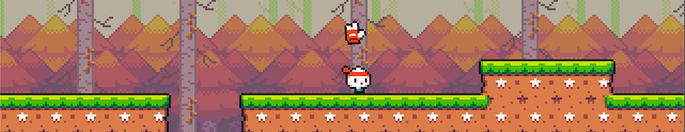
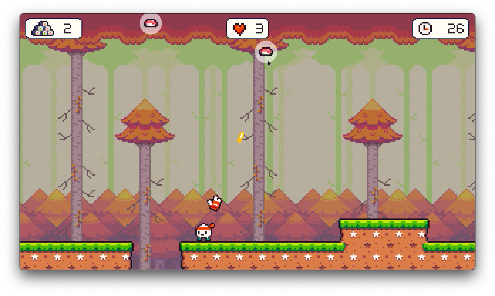

# 2D Game: Onion Lad

## Description

Play as Onion in this tiny 2D platformer pixel art game! Shoot falling sushi with bullets, get higher score. Fast-paced fun awaits!

## Gameplay

## How to Play

1. Download and install the game from [itch.io](https://rpraveen.itch.io/onion-lad).
2. Play the game on the Browser Or Download for Mac, Windows.

Controls

Move left: A Key / Left Arrow

Move right: D Key / Right Arrow

Jump: W Key

Shoot: Mouse Left Click

## System Requirements

- OS: Windows 7/8/10 64 bit, macOS,
- CPU: Dual-core processor, 2.0 GHz
- RAM: 1GB
- Storage: 50 MB available space

## Credits

- [Kenney](https://kenney.nl)
- [Grafxkid](https://grafxkid.itch.io)
- [AlexDev](https://unityalexdev.com)

## Follow Me

Stay updated with the latest news and releases by following me on social media:

- Twitter: [Twitter Handle](twitter.com/rprav_n)
- LinkedIn: [LinkedIn Handle](linkedin.com/in/rprav-n)

Thank you for playing Onion Lad! We hope you enjoy the adventure. Please leave a review on itch.io to share your feedback. 
Happy gaming!
